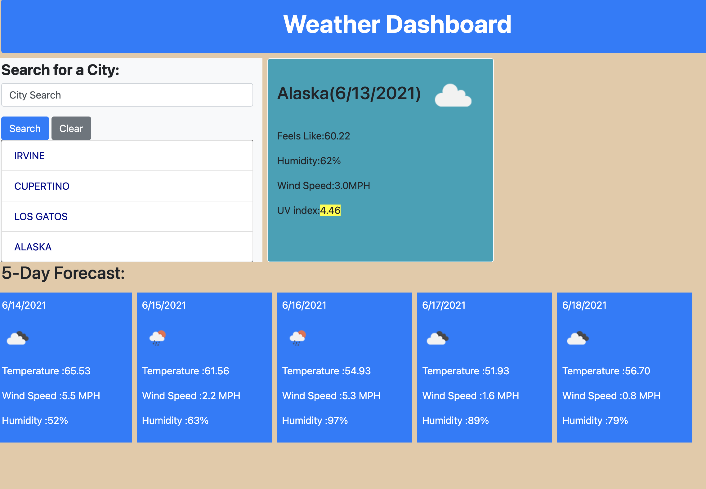

# Weather-Dashboard

## About this challenge

This challenge is to build a weather dashboard that will run in the browser and feature dynamically updated HTML and CSS. 

The [OpenWeather One Call API](https://openweathermap.org/api/one-call-api) is used to retrieve weather data for cities. A`localStorage` to store any persistent data.

## User Story

A traveler can look at the weather outlook for multiple cities so that they can plan a trip accordingly

## Criteria

- When the user search for a city, then presented with current and future conditions for that city and that city is added to the search history.

- When current weather conditions for that city is viewed,then presented with the city name, the date, an icon representation of weather conditions, the temperature, the humidity, the wind speed, and the UV index.

- When the UV index is viewed, then presented with a color that indicates whether the conditions are favorable, moderate, or severe.

- When future weather conditions for that city is viewed, then  presented with a 5-day forecast that displays the date, an icon representation of weather conditions, the temperature, the wind speed, and the humidity.

- When clicked on a city in the search history
then again presented with current and future conditions for that city

The following image demonstrates the application functionality:

## Weather Dashboard mockup

## Technologies Used:
- HTML
- CSS
- jQuery
- Bootstrap

#### Sindhu Pillai

